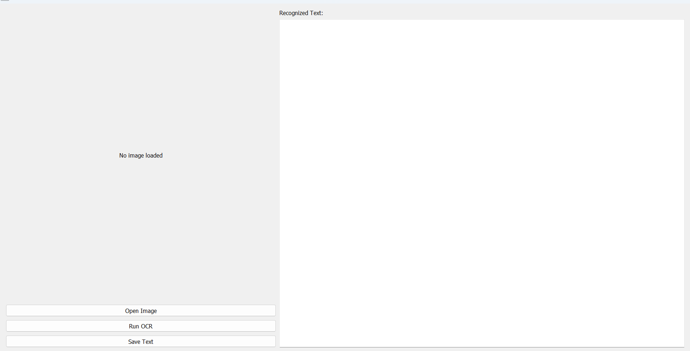
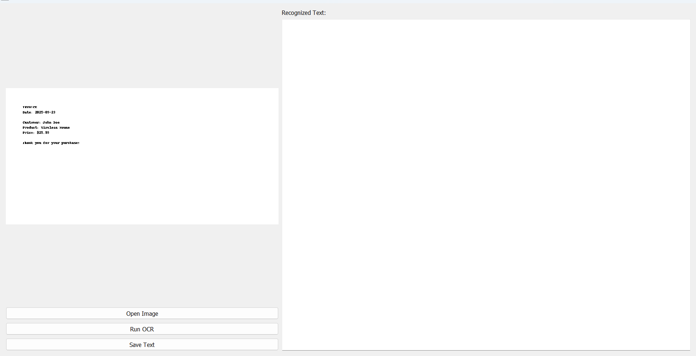
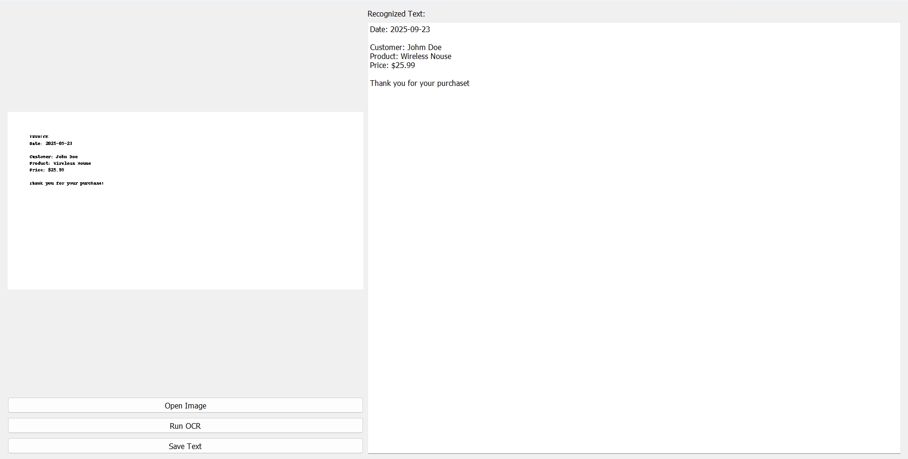

#  Belajar OCR-Tesseract-GUI

Proyek ini merupakan aplikasi GUI sederhana untuk melakukan **OCR (Optical Character Recognition)** menggunakan:

- **Python**
- **PyQt5** (untuk tampilan antarmuka pengguna)
- **Tesseract-OCR** (engine untuk mengenali teks dari gambar)
- **OpenCV** (untuk membaca dan menampilkan gambar)
- **PIL (Pillow)** (untuk konversi gambar ke format yang dibaca oleh Tesseract)

---

##  Yang Telah Dipelajari

1. **Dasar OCR (Optical Character Recognition)**
   - Menggunakan library `pytesseract` untuk membaca teks dari gambar.
   - Mengetahui bahwa Tesseract membutuhkan gambar dalam format RGB dengan kualitas baik (tidak blur, jelas).

2. **Membuat GUI dengan PyQt5**
   - Menampilkan gambar menggunakan `QLabel`.
   - Menampilkan teks hasil OCR di `QTextEdit`.
   - Menambahkan tombol untuk membuka gambar, menjalankan OCR, dan menyimpan hasil teks.

3. **Proses Gambar dan Konversi**
   - Menggunakan `cv2.imdecode()` dan `cv2.cvtColor()` untuk membaca dan mengubah format warna gambar.
   - Mengubah gambar ke format `PIL.Image` sebelum diproses oleh Tesseract.

4. **Penyimpanan Teks**
   - Menyimpan hasil OCR ke file `.txt` dengan nama otomatis berdasarkan tanggal dan waktu.

5. **Pengaturan Path**
   - Menentukan path executable Tesseract dan folder `tessdata` secara manual.

---

## 💡 Fitur Aplikasi

-  Membuka gambar (PNG, JPG, JPEG, BMP, TIF)
-  Menampilkan gambar dalam tampilan GUI
-  Menjalankan proses OCR menggunakan Tesseract
-  Menampilkan teks hasil OCR di sebelah kanan
-  Menyimpan hasil teks ke file `.txt` secara otomatis

---

##  Screenshot Aplikasi

###  UI Awal

###  Setelah Membuka Gambar

###  Hasil Setelah OCR

---

##  Struktur Folder

OCR-Tesseract-GUI/
├── OCR_Tesseract-GUI.py        # File utama aplikasi GUI
├── README.md                   # Dokumentasi proyek
├── screenshots/                # Screenshot tampilan aplikasi
│   ├── ui_awal.png
│   ├── setelah_open_image.png
│   └── hasil_ocr.png
├── contoh-gambar/              # Gambar untuk uji coba OCR
│   └── sample_text.png

---

##  Cara Menjalankan

1. **Install library yang dibutuhkan:**
    pip install pytesseract pillow opencv-python PyQt5

2. **Pastikan Tesseract-OCR sudah terinstal**, misalnya di:
    E:\Data\Tesseract_ORC\tesseract.exe

3. **Pastikan folder tessdata berisi file bahasa (misal: eng.traineddata, ind.traineddata) berada di:**
    E:\Data\Tesseract_ORC\tessdata

4. **Jalankan aplikasi:**
    python OCR_Tesseract-GUI.py

**Tips Penggunaan**
Gunakan gambar dengan teks yang jelas dan tidak blur untuk hasil terbaik.
Bahasa OCR default adalah eng (Inggris). Untuk teks berbahasa Indonesia, ubah ke ind di bagian kode berikut:
text = pytesseract.image_to_string(pil_img, lang="ind")

**Dibuat Oleh**
**Nama**: Ahmad Alfarizi
**Tanggal**: 23 September 2025
**Proyek**: Belajar OCR GUI dengan Python + PyQt5 + Tesseract
